<div align="center">


# CampusOne

### University Management System

A scalable, cloud-powered University Management System built with **Flutter** and **Firebase**, providing dedicated portals for **Administrators**, **Lecturers**, and **Students**.

<br>

[](https://flutter.dev)
[](https://firebase.google.com)
[](https://firebase.google.com/products/firestore)
[](https://firebase.google.com/products/auth)
[](https://dart.dev)
[](LICENSE)

</div>

---

## 📖 Overview

CampusOne is a modern **University Management System (UMS)** designed to digitize academic operations through a secure, role-based architecture.

The platform provides dedicated portals for **Administrators**, **Lecturers**, and **Students**, enabling seamless management of academic activities including student records, lecturer management, attendance tracking, grading, notices, courses, and departmental administration.

Built using **Flutter** and **Firebase**, CampusOne leverages real-time cloud synchronization to deliver a responsive and scalable experience across Android, Web, and Desktop platforms.

---

## ✨ Key Highlights

- 🎓 Complete University Management Platform
- 👨‍💼 Administrator Portal
- 👨‍🏫 Lecturer Portal
- 👨‍🎓 Student Portal
- ☁️ Firebase Cloud Backend
- 🔐 Secure Firebase Authentication
- 📊 Real-Time Firestore Database
- 📱 Responsive Flutter UI
- 🏗️ Feature-Based Clean Architecture
- ⚡ Cross Platform Support

---

# 📱 Application Preview

| Login | Admin Dashboard | Student Dashboard |
|:------:|:---------------:|:-----------------:|
| 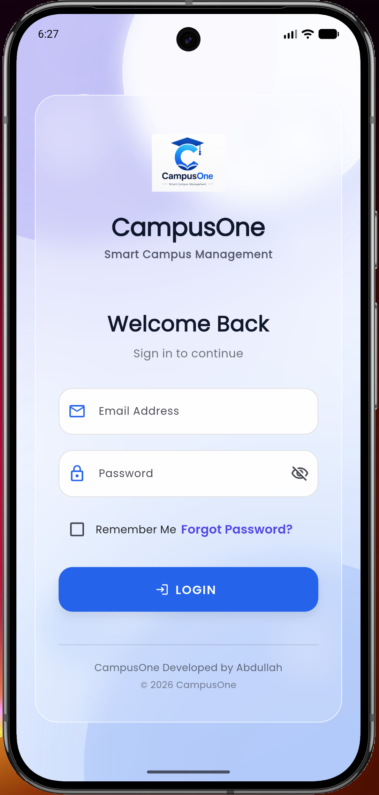 | 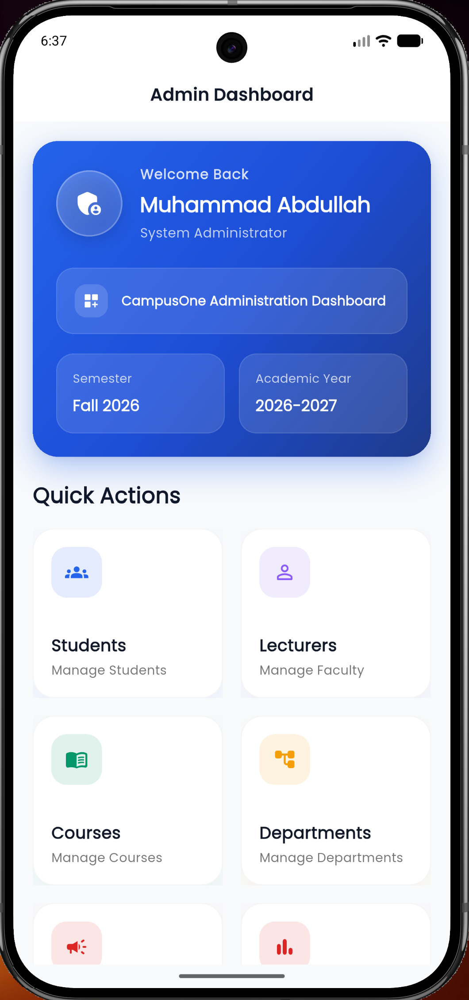 | 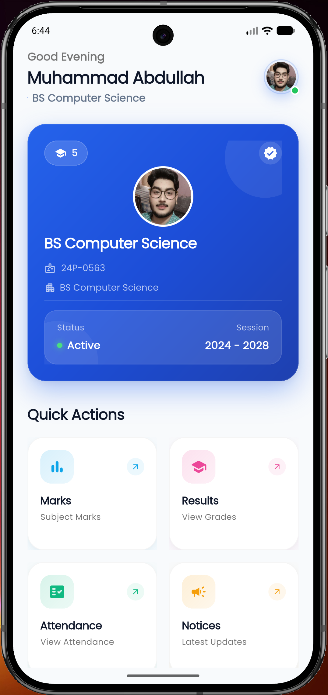 |
| Secure Authentication | Administrator Panel | Student Dashboard |

---

| Lecturer Dashboard | Student Management | Lecturer Management |
|:------------------:|:------------------:|:-------------------:|
| 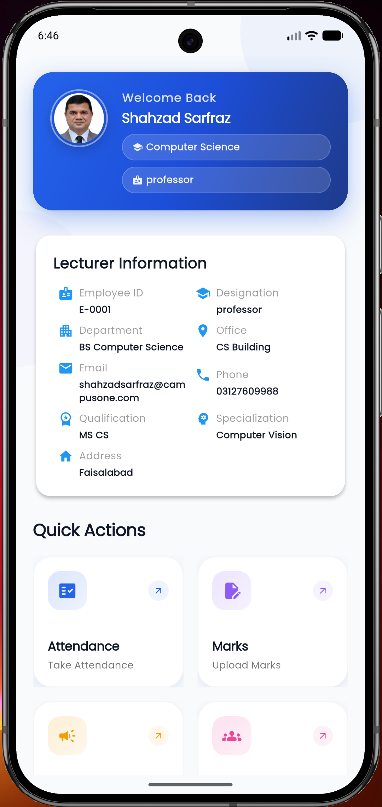 | 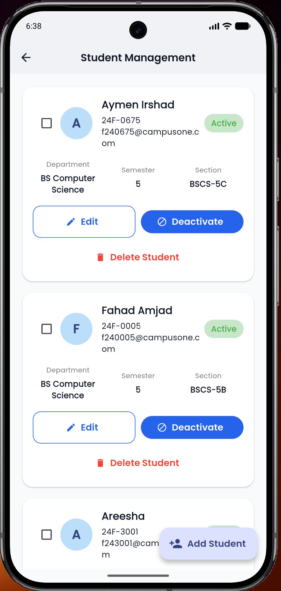 | 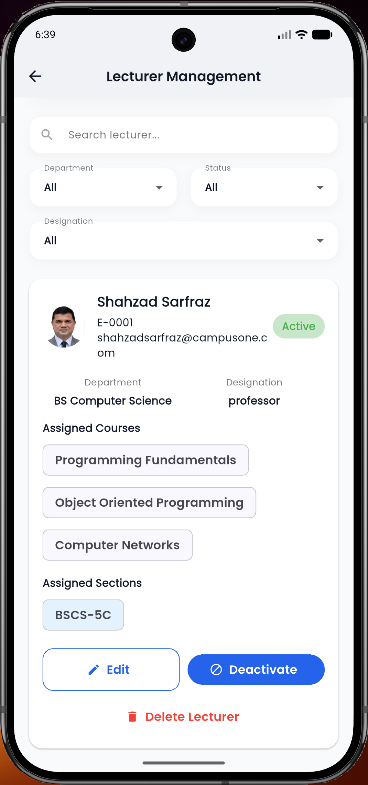 |
| Lecturer Portal | Student Records | Lecturer Records |

---

| Attendance | Grades | Notices |
|:----------:|:------:|:-------:|
| 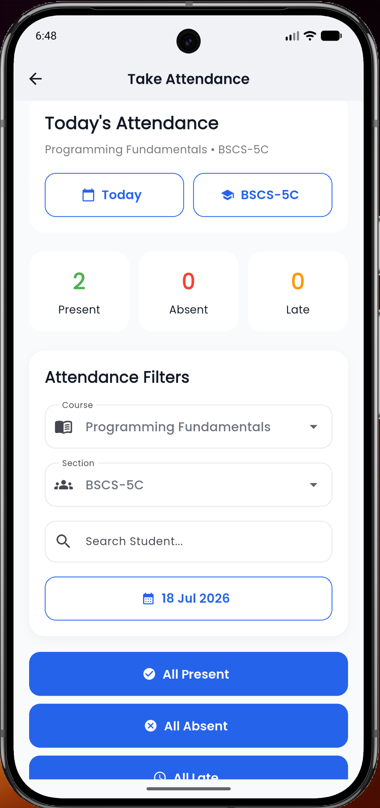 | 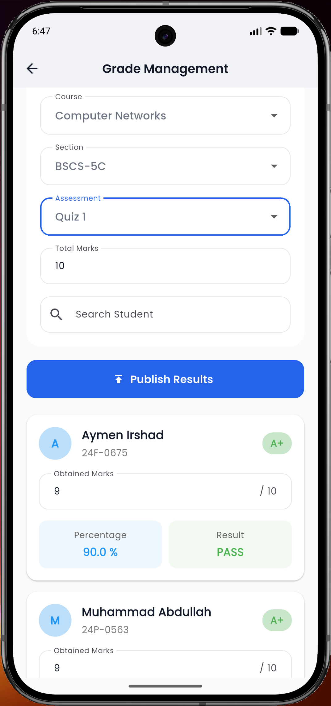 | 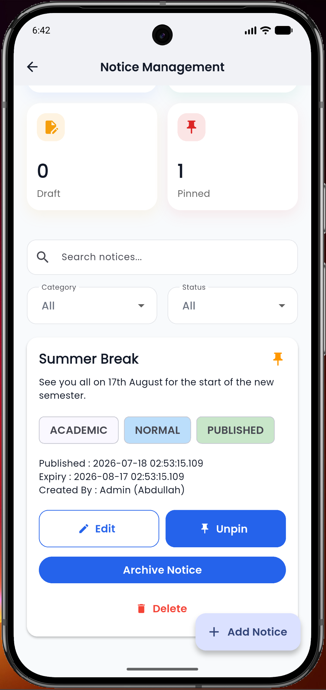 |
| Attendance Management | Grade Management | Notice Board |

---

| Course Management | Reports | Student List |
|:-----------------:|:-------:|:------------:|
| 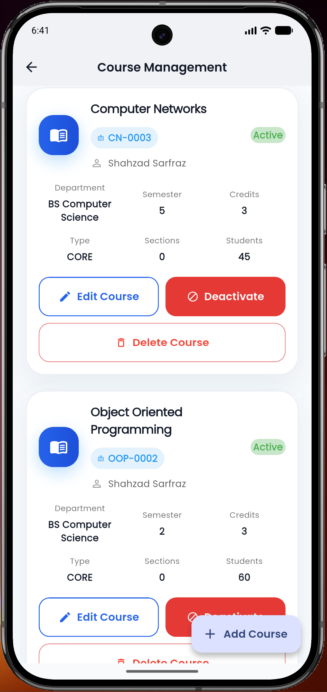 | 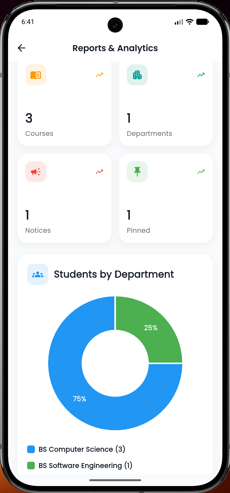 | 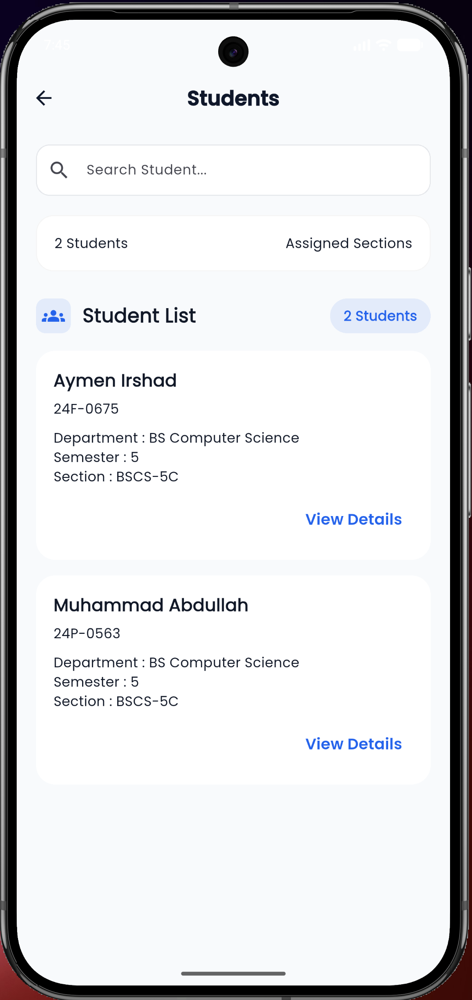 |
| Academic Courses | Reports & Analytics | Student Directory |

 
---

# ✨ Features

## 👨‍💼 Administrator Portal

The administrator has complete control over the university management system.

### Core Features

- Secure Administrator Authentication
- Dashboard with University Statistics
- Student Management (Add, Edit, Delete)
- Lecturer Management (Add, Edit, Delete)
- Course Management
- Attendance Management
- Grade Management
- Notice Management
- Academic Reports
- User Account Management
- Real-time Firestore Synchronization

---

## 👨‍🏫 Lecturer Portal

Designed to simplify academic activities for faculty members.

### Core Features

- Secure Lecturer Login
- Personal Dashboard
- View Assigned Students
- Student Academic Profiles
- Attendance Management
- Grade Submission & Updates
- Publish Student Results
- View Course Information
- View University Notices

---

## 👨‍🎓 Student Portal

Students can monitor their academic progress from anywhere.

### Core Features

- Secure Student Login
- Personal Dashboard
- Attendance Records
- Grade Reports
- Course Information
- Academic Notices
- Personal Profile
- Semester Information
- Real-time Academic Updates

---

# 🛠️ Technology Stack

| Category | Technologies |
|-----------|--------------|
| **Frontend** | Flutter, Dart |
| **State Management** | Provider, Flutter Bloc |
| **Backend Services** | Firebase Authentication, Cloud Firestore |
| **Navigation** | GoRouter |
| **Architecture** | Clean Architecture, Feature-Based Structure |
| **UI Framework** | Material Design 3 |
| **Development Tools** | Android Studio, VS Code |
| **Version Control** | Git, GitHub |
| **Platforms** | Android, Web, Windows |

---

## 💡 Core Technologies

<div align="center">

| Flutter | Firebase | Firestore | Dart |
|:-------:|:--------:|:---------:|:----:|
| Cross-platform UI | Authentication | Cloud Database | Programming Language |

| Provider | Bloc | GoRouter | Material 3 |
|:--------:|:----:|:---------:|:----------:|
| State Management | Business Logic | Navigation | UI Components |

</div>

---

# 🏗️ Architecture

CampusOne follows a **Feature-Based Clean Architecture**, separating presentation, business logic, data access, and services into independent modules.

```text
lib/

│
├── app/

│
├── core/
│   ├── services/
│   ├── routes/
│   ├── widgets/
│   └── utils/

│
├── features/
│   ├── authentication/
│   ├── admin/
│   ├── lecturer/
│   ├── student/
│   ├── attendance/
│   ├── grades/
│   ├── notices/
│   └── courses/

│
└── firebase_options.dart
```

---

# 🚀 Why CampusOne?

CampusOne is designed as a complete digital ecosystem for higher education institutions, providing seamless collaboration between administrators, lecturers, and students through a unified platform.

### Key Strengths

- 🎓 Complete University Management Solution
- 👥 Dedicated Portals for Admins, Lecturers, and Students
- ☁️ Cloud-Based Architecture powered by Firebase
- ⚡ Real-Time Academic Data Synchronization
- 📊 Centralized Attendance & Grade Management
- 📢 Integrated Notice Management System
- 📱 Responsive Experience across Android, Web, and Desktop
- 🏗️ Modular Feature-Based Clean Architecture
- 🔐 Secure Role-Based Authentication & Authorization
- 🚀 Built with Scalability and Maintainability in Mind

---

# 🏢 System Modules

CampusOne is organized into independent modules that work together to deliver a complete university management experience.

---

## 👨‍💼 Administration Module

The central control panel for institutional management.

| Capabilities |
|--------------|
| Student Management |
| Lecturer Management |
| Course Management |
| Attendance Monitoring |
| Grade Management |
| Notice Management |
| Dashboard Analytics |
| Academic Reports |
| User Account Administration |

---

## 👨‍🏫 Faculty Module

Empowering lecturers to manage academic activities efficiently.

| Capabilities |
|--------------|
| Personal Dashboard |
| Student Directory |
| Attendance Recording |
| Grade Submission |
| Grade Publishing |
| Course Information |
| Student Academic Profiles |
| University Notices |

---

## 👨‍🎓 Student Module

Providing students with instant access to their academic information.

| Capabilities |
|--------------|
| Personal Dashboard |
| Attendance Records |
| Semester Grades |
| Course Information |
| Academic Notices |
| Personal Profile |
| Academic Progress Tracking |

---

## 📚 Course Management

A centralized academic course management system.

### Features

- Course Creation
- Course Updates
- Credit Hour Management
- Department-wise Organization
- Semester Allocation
- Course Assignment

---

## 📝 Attendance Management

Digitized attendance management for improved academic monitoring.

### Features

- Attendance Recording
- Attendance History
- Student Attendance Reports
- Lecturer Attendance Interface
- Real-Time Updates

---

## 🎯 Grade Management

A complete grading workflow for academic evaluation.

### Features

- Assessment Management
- Quiz & Assignment Marks
- Mid & Final Results
- Grade Publishing
- Student Result Portal

---

## 📢 Notice Management

A centralized communication platform for the university.

### Features

- Publish Notices
- Scheduled Announcements
- Student Notifications
- Lecturer Notifications
- University-wide Updates

---

## 📊 Reports & Analytics

Real-time insights for institutional decision making.

### Features

- Dashboard Statistics
- Student Overview
- Lecturer Overview
- Course Statistics
- Attendance Analytics
- Academic Reports

---

# 🎯 Role-Based Access Matrix

CampusOne implements a secure **Role-Based Access Control (RBAC)** system, ensuring every user has access only to the functionality relevant to their responsibilities.

| Feature | 👨‍💼 Admin | 👨‍🏫 Lecturer | 👨‍🎓 Student |
|:--------|:----------:|:------------:|:-----------:|
| Secure Login | ✅ | ✅ | ✅ |
| Personalized Dashboard | ✅ | ✅ | ✅ |
| View Profile | ✅ | ✅ | ✅ |
| Manage Students | ✅ | ❌ | ❌ |
| Manage Lecturers | ✅ | ❌ | ❌ |
| Manage Courses | ✅ | ❌ | ❌ |
| Record Attendance | ✅ | ✅ | ❌ |
| View Attendance | ✅ | ✅ | ✅ |
| Submit Grades | ✅ | ✅ | ❌ |
| View Grades | ✅ | ❌ | ✅ |
| Publish Grades | ✅ | ✅ | ❌ |
| Publish Notices | ✅ | ✅ | ❌ |
| View Notices | ✅ | ✅ | ✅ |
| Academic Reports | ✅ | ❌ | ❌ |
| Dashboard Analytics | ✅ | ❌ | ❌ |

> **CampusOne follows a centralized role-based permission model where every authenticated user is granted access according to their assigned institutional role.**

---

# 🔄 System Workflow

```text
                 Administrator
                       │
        ┌──────────────┼──────────────┐
        │              │              │
        ▼              ▼              ▼
  Manage Users   Manage Courses   Publish Notices
        │
        ▼
 Create Lecturer & Student Accounts
        │
        ▼
──────────────────────────────────────────────
                Lecturer Portal
──────────────────────────────────────────────
        │
        ├── View Assigned Students
        ├── Record Attendance
        ├── Submit Grades
        ├── Publish Results
        └── View Notices
                 │
                 ▼
──────────────────────────────────────────────
                Student Portal
──────────────────────────────────────────────
        │
        ├── View Attendance
        ├── View Grades
        ├── View Courses
        ├── View Notices
        └── Monitor Academic Progress
```

---

# 🔐 Security Features

CampusOne is designed with security and maintainability in mind.

| Security Layer | Implementation |
|----------------|----------------|
| Authentication | Firebase Authentication |
| Authorization | Role-Based Access Control (RBAC) |
| Database | Cloud Firestore |
| Data Synchronization | Real-Time Firestore Streams |
| User Isolation | Role-specific permissions |
| Session Management | Firebase Secure Authentication |

### Security Highlights

- 🔒 Secure Firebase Authentication
- 👤 Role-Based Authorization
- ☁️ Cloud-Hosted Firestore Database
- ⚡ Real-Time Data Synchronization
- 🛡️ Centralized User Management

---

# 📂 Project Structure

CampusOne follows a **Feature-Based Clean Architecture**, making the codebase modular, scalable, and easy to maintain.

```text
CampusOne
│
├── android/
├── ios/
├── web/
├── windows/
├── linux/
├── macos/
│
├── assets/
│   ├── images/
│   ├── icons/
│   └── screenshots/
│
├── lib/
│   │
│   ├── app/
│   │   ├── router/
│   │   └── app.dart
│   │
│   ├── core/
│   │   ├── services/
│   │   ├── widgets/
│   │   ├── utils/
│   │   ├── theme/
│   │   └── constants/
│   │
│   ├── features/
│   │   ├── authentication/
│   │   ├── admin/
│   │   ├── lecturer/
│   │   ├── student/
│   │   ├── attendance/
│   │   ├── grades/
│   │   ├── notices/
│   │   ├── courses/
│   │   └── reports/
│   │
│   ├── firebase_options.dart
│   └── main.dart
│
├── pubspec.yaml
└── README.md
```

### Architecture Principles

- 📦 Feature-Based Organization
- 🧩 Modular Components
- 🔄 Separation of Concerns
- ♻️ Reusable Widgets
- 📈 Easily Scalable
- 🧪 Easy Testing

---

# 🚀 Getting Started

## Prerequisites

Before running the project, ensure you have installed:

- Flutter SDK (3.35 or later)
- Dart SDK
- Android Studio
- VS Code (optional)
- Git
- Firebase CLI (optional)

---

## Clone Repository

```bash
git clone https://github.com/abdullah-dev1/CampusOne.git
cd CampusOne
```

---

## Install Dependencies

```bash
flutter pub get
```

---

## Run Application

**Android**

```bash
flutter run
```

**Chrome**

```bash
flutter run -d chrome
```

**Windows**

```bash
flutter run -d windows
```

---

## Build Release APK

```bash
flutter build apk --release
```

---

# 📱 Supported Platforms

| Platform | Status |
|----------|:------:|
| 🤖 Android | ✅ Fully Supported |
| 🌐 Web | ✅ Fully Supported |
| 🖥️ Windows | ✅ Fully Supported |
| 🍎 iOS | ⚠️ Not Yet Tested |
| 🍏 macOS | ⚠️ Not Yet Tested |
| 🐧 Linux | ⚠️ Not Yet Tested |

---

# 🤝 Contributing

Contributions, suggestions, and feature requests are welcome.

If you'd like to improve CampusOne:

1. Fork the repository
2. Create a new feature branch
3. Commit your changes
4. Push your branch
5. Open a Pull Request

Every contribution is appreciated.

---

# 👨‍💻 Developer

<div align="center">

## Muhammad Abdullah

**Computer Science Student**
FAST – National University of Computer and Emerging Sciences
Faisalabad, Pakistan

Passionate about building scalable software, mobile applications, and full-stack solutions.

<br>

[](https://github.com/abdullah-dev1)
[](https://linkedin.com/)

</div>

---

# 📜 License

This project is licensed under the **MIT License**.

You are free to use, modify, and distribute this project under the terms of the license.

---

# ⭐ Support

If you found this project helpful, consider giving it a ⭐ on GitHub.

Your support helps the project reach more developers and motivates future improvements.

---

<div align="center">

### CampusOne

**Modern University Management System**

### Developed by Muhammad Abdullah

© 2026 Muhammad Abdullah

</div>
